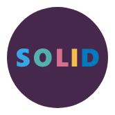

# 

## SOLID

Os princípios SOLID são um conjunto de diretrizes para projetar software de forma modular, flexível e de fácil manutenção. Aqui está uma lista resumida dos princípios SOLID:

1. **Princípio da Responsabilidade Única (Single Responsibility Principle - SRP)**: Cada classe deve ter apenas uma única responsabilidade. Isso facilita a compreensão, o teste e a manutenção do código.

2. **Princípio do Aberto/Fechado (Open/Closed Principle - OCP)**: As entidades de software (classes, módulos, funções etc.) devem ser abertas para extensão, mas fechadas para modificação. Isso significa que o comportamento existente não deve ser alterado, mas sim estendido por meio de novas funcionalidades.

3. **Princípio da Substituição de Liskov (Liskov Substitution Principle - LSP)**: Os objetos de uma classe derivada devem poder ser substituídos pelos objetos da classe base sem alterar a integridade do programa. Isso garante que as classes derivadas sejam compatíveis com as classes base e não introduzam comportamentos inesperados.

4. **Princípio da Segregação de Interface (Interface Segregation Principle - ISP)**: Os clientes não devem ser forçados a depender de interfaces que não utilizam. Em vez de uma única interface grande, é preferível ter várias interfaces menores e mais específicas.

5. **Princípio da Inversão de Dependência (Dependency Inversion Principle - DIP)**: Dependa de abstrações e não de implementações concretas. Módulos de alto nível não devem depender de módulos de baixo nível. Ambos devem depender de abstrações.

Esses princípios SOLID são diretrizes importantes que ajudam os desenvolvedores a escrever código mais limpo, flexível e de fácil manutenção. Ao aplicar esses princípios, é possível criar software mais modular e menos propenso a problemas de dependência e acoplamento excessivo.
